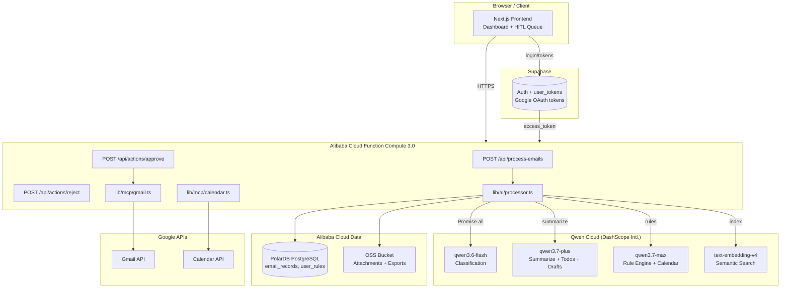

# Email Digest Agent — Project Plan

## Hackathon Submission Checklist

- [ ] Public GitHub repo with open source license (MIT) visible in About section
- [ ] Alibaba Cloud deployment proof (`docs/alibaba-cloud-proof.md` + recording)
- [ ] Architecture diagram (see below)
- [ ] 3-minute demo video (YouTube / Vimeo)
- [ ] Text description of features
- [ ] Track identified: **Productivity & Automation** (AI-powered email workflow)
- [ ] Blog / Social post (optional, for Blog Post Prize)

---

## Tech Stack

| Layer | Technology |
|---|---|
| Framework | Next.js 15 (App Router), React, TypeScript |
| Styling & UI | Tailwind CSS, shadcn/ui, Lucide Icons |
| Auth & User DB | Supabase (PostgreSQL) + Google OAuth (Gmail + Calendar scopes) |
| Email/Task DB | **Alibaba Cloud PolarDB for PostgreSQL** |
| File Storage | **Alibaba Cloud OSS** (email attachments, digest exports) |
| Backend Hosting | **Alibaba Cloud Function Compute 3.0** (Next.js standalone) |
| Container Registry | **Alibaba Cloud ACR** (Docker image store) |
| AI — Fast tasks | **Qwen Cloud `qwen3.6-flash`** (classification, quick summaries) |
| AI — Balanced | **Qwen Cloud `qwen3.7-plus`** (summarization, todo extraction, drafts) |
| AI — Reasoning | **Qwen Cloud `qwen3.7-max`** (rule evaluation, calendar parsing) |
| AI — Embeddings | **Qwen Cloud `text-embedding-v4`** (semantic email search) |
| Tooling Protocol | `@modelcontextprotocol/sdk` (Gmail / Calendar tools) |

**Qwen Cloud API Base URL (International):** `https://dashscope-intl.aliyuncs.com/compatible-mode/v1`

**Architecture Constraint:** Core logic must be decoupled from API Route handlers so the pipeline can be migrated to an async queue later if Function Compute's execution limit is hit. Use `Promise.all` for concurrent email processing.

---

## Architecture Diagram



---

## Feature Priorities

### P0 — Must Have

- [ ] Gmail Email Reading (OAuth + fetch unread emails)
- [ ] Email Classification via `qwen3.6-flash` (Newsletter / Alert / Personal / Promotion / …)
- [ ] Email Summarization via `qwen3.7-plus` (concise per-email summary)
- [ ] Todo Extraction via `qwen3.7-plus` (actionable tasks from email bodies)
- [ ] Semantic search index via `text-embedding-v4` (stored in PolarDB pgvector)
- [ ] Daily Digest Page (`/dashboard`)
- [ ] HITL Confirmation Queue (Approve / Reject actions before execution)

### P1 — Bonus

- [ ] Auto-generate Reply Drafts via `qwen3.7-plus`
- [ ] Auto Label / Archive via Gmail API
- [ ] Google Calendar Integration via `qwen3.7-max` (parse dates → suggest events)
- [ ] User-Defined Rules Engine — `qwen3.7-max` evaluates rules against each email
  - "Always keep emails from school"
  - "Archive promotions unless discount > 40 %"
  - "Never send emails without my approval"
  - "Flag emails related to jobs, invoices, and interviews"
- [ ] OSS export: save daily digest as JSON to Alibaba Cloud OSS

### P2 — Advanced / Backlog

- [ ] Auto-unsubscribe suggestions
- [ ] Multi-user / team inbox support
- [ ] CRM integration / Slack digest / Quote generation

---

## Execution Phases

### Phase 1 — Infrastructure & Auth (Day 1)

**Goal:** Authenticated user can log in and their tokens are persisted.

- [x] Initialize Next.js project (TypeScript, Tailwind, App Router, `src/` dir)
- [x] Initialize git repository
- [ ] Add MIT License (`LICENSE` file) — required for hackathon
- [ ] Install and configure shadcn/ui
- [ ] Create Supabase project (for Google OAuth only)
- [ ] Enable Google OAuth provider in Supabase with scopes:
  - `https://mail.google.com/`
  - `https://www.googleapis.com/auth/calendar`
- [ ] Provision **Alibaba Cloud PolarDB for PostgreSQL** instance
- [ ] Create **Alibaba Cloud OSS** bucket (`email-agent-assets`)
- [ ] Implement login / logout flow (`src/app/(auth)/login/page.tsx`)
- [ ] Store `access_token` + `refresh_token` in Supabase (`user_tokens` table)

**Supabase Schema (Auth DB — minimal):**

```sql
-- User OAuth tokens (Supabase, for Google OAuth)
create table public.user_tokens (
  id uuid primary key default gen_random_uuid(),
  user_id uuid references auth.users(id) on delete cascade,
  provider text not null default 'google',
  access_token text not null,
  refresh_token text,
  expires_at timestamptz,
  created_at timestamptz default now(),
  updated_at timestamptz default now()
);
```

**Alibaba Cloud PolarDB Schema (Application DB):**

```sql
-- Enable pgvector for semantic search
create extension if not exists vector;

-- Email processing history
create table email_records (
  id uuid primary key default gen_random_uuid(),
  user_id uuid not null,
  gmail_id text not null,
  subject text,
  sender text,
  received_at timestamptz,
  category text,
  summary text,
  todos jsonb default '[]',
  recommended_action text check (recommended_action in ('archive','keep','draft_reply')),
  action_status text check (action_status in ('pending','approved','rejected','executed')) default 'pending',
  raw_snippet text,
  embedding vector(1536),   -- text-embedding-v4 output
  oss_attachment_key text,  -- Alibaba Cloud OSS key for attachments
  processed_at timestamptz default now()
);

create index on email_records using hnsw (embedding vector_cosine_ops);

-- User-defined rules (P1)
create table user_rules (
  id uuid primary key default gen_random_uuid(),
  user_id uuid not null,
  rule_text text not null,
  created_at timestamptz default now()
);
```

---

### Phase 2 — Core Gmail Tools / MCP (Day 1–2)

**Goal:** Utility layer that reads/writes Gmail, fully decoupled from API routes.

- [ ] `src/lib/mcp/gmail.ts`
  - `fetchUnreadEmails(accessToken, limit)` → `Email[]`
  - `archiveEmail(accessToken, id)` → stub returning `{ success: true }`
  - `createDraft(accessToken, to, subject, body)` → stub
- [ ] `src/lib/mcp/calendar.ts` (P1)
  - `fetchUpcomingEvents(accessToken)`
  - `createEvent(accessToken, event)`
- [ ] Add `@modelcontextprotocol/sdk` as MCP transport layer (optional / P1)

---

### Phase 3 — AI Processing Pipeline (Day 2)

**Goal:** Each email is classified, summarised, and indexed concurrently using multiple Qwen models.

- [ ] `src/lib/ai/qwen.ts` — shared Qwen client
  - Base URL: `https://dashscope-intl.aliyuncs.com/compatible-mode/v1`
  - Export three clients: `qwenFlash`, `qwenPlus`, `qwenMax`
- [ ] `src/lib/ai/processor.ts`
  - `processEmailsBatched(emails, userRules?)` using `Promise.all`
  - Per email pipeline:
    1. **`qwen3.6-flash`** → classify category (fast + cheap)
    2. **`qwen3.7-plus`** → summarize + extract todos + recommended action
    3. **`text-embedding-v4`** → generate 1536-dim embedding for semantic search
    4. *(if rules exist)* **`qwen3.7-max`** → evaluate user rules against email
- [ ] Structured output (JSON mode) schema:

```ts
{
  category: "newsletter" | "alert" | "personal" | "promotion" | "other";
  summary: string;          // ≤ 2 sentences
  todos: string[];          // extracted action items
  recommendedAction: "archive" | "keep" | "draft_reply";
  ruleMatches?: string[];   // rules triggered (P1)
}
```

- [ ] Persist to **Alibaba Cloud PolarDB** via `pg` driver
- [ ] Upload attachment URLs to **Alibaba Cloud OSS** (`src/lib/oss.ts`)
- [ ] API route: `POST /api/process-emails` (`maxDuration = 60`)

---

### Phase 4 — Frontend Dashboard (Day 3)

**Goal:** Users see their daily digest and can approve/reject AI-recommended actions.

- [ ] `src/app/dashboard/page.tsx` — server component, fetches `email_records`
- [ ] `src/components/digest/DigestSection.tsx` — renders summaries grouped by category
- [ ] `src/components/digest/EmailCard.tsx` — single email card (category badge, summary, todos)
- [ ] `src/components/hitl/ActionQueue.tsx` — lists `pending` records
- [ ] `src/components/hitl/ActionItem.tsx` — shows recommended action + Approve / Reject buttons
- [ ] API route: `POST /api/actions/approve` and `POST /api/actions/reject`
  - Update `action_status` in Supabase
  - On approve: execute `archiveEmail` or `createDraft`

---

### Phase 5 — P1 Features & Rule Engine (Day 4)

**Goal:** Users can define natural-language rules; AI respects them at classification time.

- [ ] `src/app/settings/page.tsx` — textarea to enter / edit rules
- [ ] Save rules to `user_rules` table (PolarDB)
- [ ] Load rules in `processEmailsBatched` and pass to `qwen3.7-max` for evaluation
- [ ] Semantic email search using `text-embedding-v4` + PolarDB pgvector
- [ ] Google Calendar tool via `qwen3.7-max` (function calling)
- [ ] Draft reply generation using `qwen3.7-plus`
- [ ] Auto-label / archive execution (real Gmail API calls replacing stubs)
- [ ] Daily digest export → save JSON to **Alibaba Cloud OSS**

---

### Phase 6 — Alibaba Cloud Deployment (Day 4–5)

**Goal:** Backend running on Alibaba Cloud with proof for hackathon submission.

- [ ] `Dockerfile` — Next.js standalone build
- [ ] Push image to **Alibaba Cloud ACR** (Container Registry)
- [ ] Deploy to **Alibaba Cloud Function Compute 3.0** (Custom Container runtime)
  - Set environment variables (Qwen API key, PolarDB connection string, OSS keys)
  - Configure HTTP trigger
- [ ] Verify API endpoints via FC public URL
- [ ] Create `docs/alibaba-cloud-proof.md` — document deployed FC function URL, OSS bucket, PolarDB endpoint
- [ ] Record short proof video showing FC console + live API call

---

## Folder Structure (Target)

```
├── docs/
│   └── alibaba-cloud-proof.md    # Hackathon: FC URL, OSS bucket, PolarDB proof
├── Dockerfile                    # Next.js standalone → Alibaba Cloud FC
├── LICENSE                       # MIT — required by hackathon
src/
├── app/
│   ├── (auth)/
│   │   └── login/page.tsx
│   ├── api/
│   │   ├── process-emails/route.ts   # maxDuration = 60
│   │   └── actions/
│   │       ├── approve/route.ts
│   │       └── reject/route.ts
│   ├── dashboard/page.tsx
│   ├── settings/page.tsx
│   ├── layout.tsx
│   └── page.tsx
├── components/
│   ├── digest/
│   │   ├── DigestSection.tsx
│   │   └── EmailCard.tsx
│   └── hitl/
│       ├── ActionQueue.tsx
│       └── ActionItem.tsx
├── lib/
│   ├── ai/
│   │   ├── qwen.ts               # Shared Qwen client (flash / plus / max)
│   │   └── processor.ts          # processEmailsBatched()
│   ├── mcp/
│   │   ├── gmail.ts
│   │   └── calendar.ts
│   ├── oss.ts                    # Alibaba Cloud OSS upload/download
│   ├── db.ts                     # PolarDB pg client
│   └── supabase/
│       ├── client.ts
│       └── server.ts
└── types/
    └── email.ts
```

---

## Environment Variables

```env
# Supabase (Auth only)
NEXT_PUBLIC_SUPABASE_URL=
NEXT_PUBLIC_SUPABASE_ANON_KEY=
SUPABASE_SERVICE_ROLE_KEY=

# Qwen Cloud (International endpoint)
QWEN_API_KEY=                     # sk-... from home.qwencloud.com/api-keys
QWEN_BASE_URL=https://dashscope-intl.aliyuncs.com/compatible-mode/v1

# Alibaba Cloud PolarDB (PostgreSQL-compatible)
POLARDB_HOST=
POLARDB_PORT=5432
POLARDB_DB=email_agent
POLARDB_USER=
POLARDB_PASSWORD=

# Alibaba Cloud OSS
ALIYUN_OSS_REGION=                # e.g. oss-ap-southeast-1
ALIYUN_OSS_BUCKET=email-agent-assets
ALIYUN_ACCESS_KEY_ID=
ALIYUN_ACCESS_KEY_SECRET=

# Google (managed via Supabase OAuth)
GOOGLE_CLIENT_ID=
GOOGLE_CLIENT_SECRET=
```

---

## Next Steps (Start Here)

1. Add MIT `LICENSE` file to repo root
2. Install shadcn/ui: `npx shadcn@latest init`
3. Install core deps:
   ```bash
   npm install @supabase/supabase-js @supabase/ssr ai @modelcontextprotocol/sdk pg ali-oss
   npm install -D @types/pg
   ```
4. Create Supabase project → run Auth schema
5. Provision Alibaba Cloud PolarDB → run Application DB schema
6. Create Alibaba Cloud OSS bucket + RAM user with OSS + FC permissions
7. Get Qwen Cloud API key from `home.qwencloud.com/api-keys`
8. Configure Google OAuth in Supabase dashboard
9. Build login page and verify token storage → commit
10. Proceed to Phase 2

---

## Qwen Model Usage Summary

| Model | Use Case | Why |
|---|---|---|
| `qwen3.6-flash` | Email category classification | Cheapest + fastest, simple task |
| `qwen3.7-plus` | Summarization, todo extraction, draft replies | Best cost/performance balance |
| `qwen3.7-max` | Rule evaluation, calendar parsing, complex reasoning | Highest accuracy for agent tasks |
| `text-embedding-v4` | Semantic search index over processed emails | Native Qwen embedding model |
