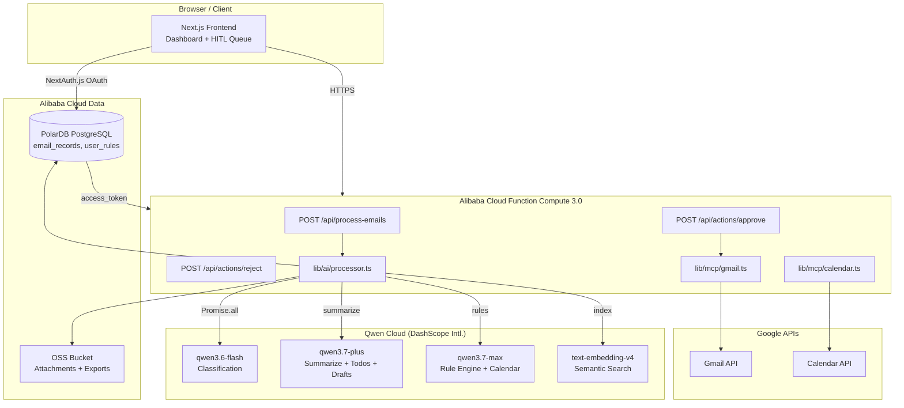

# Email Digest Agent — Project Plan

## Hackathon Submission Checklist

- [ ] Public GitHub repo with open source license (MIT) visible in About section
- [ ] Alibaba Cloud deployment proof (`docs/alibaba-cloud-proof.md` + recording)
- [ ] Architecture diagram (see below)
- [ ] 3-minute demo video (YouTube / Vimeo)
- [ ] Text description of features
- [ ] Track identified: **Productivity & Automation** (AI-powered email workflow)
- [ ] Blog / Social post (optional, for Blog Post Prize)

---

## Tech Stack

| Layer | Technology |
|---|---|
| Framework | **Next.js 16** (App Router), React 19, TypeScript 5 |
| Styling & UI | Tailwind CSS, shadcn/ui, Lucide Icons |
| Auth & All DB | **Alibaba Cloud PolarDB for PostgreSQL** (single source of truth) |
| Auth Framework | **NextAuth.js v5 (Auth.js)** + Google OAuth + PolarDB adapter |
| File Storage | **Alibaba Cloud OSS** — Phase 2 only (Phase 1 stores attachment URLs + digest JSON in PolarDB) |
| Backend Hosting | **Alibaba Cloud Function Compute 3.0** (Next.js standalone) |
| Container Registry | **Alibaba Cloud ACR** (Docker image store) |
| AI — Fast tasks | **Qwen Cloud `qwen3.6-flash`** (classification, quick summaries) |
| AI — Balanced | **Qwen Cloud `qwen3.7-plus`** (summarization, todo extraction, drafts) |
| AI — Reasoning | **Qwen Cloud `qwen3.7-max`** (rule evaluation, calendar parsing) |
| AI — Embeddings | **Qwen Cloud `text-embedding-v4`** (semantic email search) |
| Tooling Protocol | `@modelcontextprotocol/sdk` (Gmail / Calendar tools) |

**Qwen Cloud API Base URL (International):** `https://dashscope-intl.aliyuncs.com/compatible-mode/v1`

**Runtime Requirement:** Node.js 20.9+ (Next.js 16 minimum; Node 18 is not supported).

**Architecture Constraint:** Core logic must be decoupled from API Route handlers (keeps the codebase portable and testable). Use `Promise.all` for concurrent email processing. No `maxDuration` cap applies — Alibaba Cloud Function Compute supports timeouts up to 24 hours, far exceeding Vercel's 60 s limit.

**Next.js 16 Key Patterns to Follow:**
- `proxy.ts` instead of `middleware.ts` (middleware is deprecated in v16; proxy runs Node.js runtime only, no Edge)
- All Request APIs are async: `await cookies()`, `await headers()`, `await params`, `await searchParams`
- Use `"use cache"` directive on Server Components / functions that should be cached (replaces PPR)
- `cacheTag()` / `cacheLife()` are stable (no `unstable_` prefix)
- `turbopack` config is top-level in `next.config.ts` (not under `experimental`)
- `output: "standalone"` in `next.config.ts` for Docker/Function Compute deployment
- Linting: use `eslint` CLI directly — `next lint` is removed in v16
- Run `npx next typegen` to generate `PageProps` / `LayoutProps` type helpers after adding routes

---



---

## Feature Priorities

### P0 — Must Have

- [ ] Gmail Email Reading (OAuth + fetch unread emails)
- [ ] Email Classification via `qwen3.6-flash` (Newsletter / Alert / Personal / Promotion / …)
- [ ] Email Summarization via `qwen3.7-plus` (concise per-email summary)
- [ ] Todo Extraction via `qwen3.7-plus` (actionable tasks from email bodies)
- [ ] Semantic search index via `text-embedding-v4` (stored in PolarDB pgvector)
- [ ] Daily Digest Page (`/dashboard`)
- [ ] HITL Confirmation Queue (Approve / Reject actions before execution)

### P1 — Bonus

- [ ] Auto-generate Reply Drafts via `qwen3.7-plus`
- [ ] Auto Label / Archive via Gmail API
- [ ] Google Calendar Integration via `qwen3.7-max` (parse dates → suggest events)
- [ ] User-Defined Rules Engine — `qwen3.7-max` evaluates rules against each email
  - "Always keep emails from school"
  - "Archive promotions unless discount > 40 %"
  - "Never send emails without my approval"
  - "Flag emails related to jobs, invoices, and interviews"
- [ ] OSS export: move digest JSON from `digest_exports` table → Alibaba Cloud OSS bucket (Phase 2)

### P2 — Advanced / Backlog

- [ ] Auto-unsubscribe suggestions
- [ ] Multi-user / team inbox support
- [ ] CRM integration / Slack digest / Quote generation

---

## Execution Phases

### Phase 1 — Infrastructure & Auth (Day 1)

**Goal:** Authenticated user can log in and their tokens are persisted.

- [x] Initialize Next.js 16 project (TypeScript, Tailwind 4, App Router, `src/` dir, Turbopack default)
- [x] Initialize git repository
- [x] Add MIT License (`LICENSE` file) — required for hackathon
- [x] Install and configure shadcn/ui
- [x] Provision local Docker PostgreSQL + pgvector (mirrors PolarDB; swap connection string for PolarDB in Phase 6)
- [x] Configure **NextAuth.js v5** with Google provider — request scopes:
  - `https://mail.google.com/`
  - `https://www.googleapis.com/auth/calendar`
- [x] Run schema (NextAuth tables + application tables — see below)
- [x] Implement login / logout flow (`src/app/login/page.tsx`)
- [x] Verify `account.access_token` + `account.refresh_token` are persisted in `accounts` table

**Alibaba Cloud PolarDB Schema (single DB — all tables):**

```sql
-- ─── Extensions ────────────────────────────────────────────────────────────
create extension if not exists vector;   -- semantic search
create extension if not exists "uuid-ossp";

-- ─── NextAuth.js v5 tables (@auth/pg-adapter) ───────────────────────────────
-- These are managed automatically by the adapter; listed here for reference.
create table users (
  id uuid primary key default uuid_generate_v4(),
  name text,
  email text unique,
  "emailVerified" timestamptz,
  image text
);

create table accounts (
  id uuid primary key default uuid_generate_v4(),
  "userId" uuid not null references users(id) on delete cascade,
  type text not null,
  provider text not null,
  "providerAccountId" text not null,
  refresh_token text,
  access_token text,
  expires_at bigint,
  token_type text,
  scope text,
  id_token text,
  session_state text,
  unique (provider, "providerAccountId")
);

create table sessions (
  id uuid primary key default uuid_generate_v4(),
  "sessionToken" text unique not null,
  "userId" uuid not null references users(id) on delete cascade,
  expires timestamptz not null
);

create table verification_tokens (
  identifier text not null,
  token text not null,
  expires timestamptz not null,
  primary key (identifier, token)
);

-- ─── Application tables ─────────────────────────────────────────────────────
-- user_id references the NextAuth users table — real FK, same DB, no ghost key
create table email_records (
  id uuid primary key default uuid_generate_v4(),
  user_id uuid not null references users(id) on delete cascade,
  gmail_id text not null,
  subject text,
  sender text,
  received_at timestamptz,
  category text,
  summary text,
  todos jsonb default '[]',
  recommended_action text check (recommended_action in ('archive','keep','draft_reply')),
  action_status text check (action_status in ('pending','approved','rejected','executed')) default 'pending',
  raw_snippet text,
  embedding          vector(1536),    -- text-embedding-v4 output
  attachment_urls    jsonb       default '[]',  -- Gmail attachment URLs (no OSS in Phase 1)
  processed_at       timestamptz default now()
);

create index on email_records using hnsw (embedding vector_cosine_ops);

-- Digest exports stored as JSONB in DB (move to OSS in Phase 2)
create table digest_exports (
  id         uuid  primary key default uuid_generate_v4(),
  user_id    uuid  not null references users(id) on delete cascade,
  date       date  not null,
  payload    jsonb not null,
  created_at timestamptz default now(),
  unique (user_id, date)
);

create table user_rules (
  id uuid primary key default uuid_generate_v4(),
  user_id uuid not null references users(id) on delete cascade,
  rule_text text not null,
  created_at timestamptz default now()
);
```

---

### Phase 2 — Core Gmail Tools / MCP (Day 1–2)

**Goal:** Utility layer that reads/writes Gmail, fully decoupled from API routes.

- [x] `src/types/email.ts` — `Email`, `EmailAttachment`, `ProcessedEmail` types
- [x] `src/lib/tokens.ts` — `getGoogleAccessToken(userId)` with automatic refresh
- [x] `src/lib/mcp/gmail.ts`
  - [x] `fetchUnreadEmails(accessToken, limit)` → `Email[]` (concurrent with `Promise.all`)
  - [x] `archiveEmail(accessToken, id)` → stub
  - [x] `createDraft(accessToken, to, subject, body)` → stub
- [x] `src/lib/mcp/calendar.ts`
  - [x] `fetchUpcomingEvents(accessToken)` → stub
  - [x] `createEvent(accessToken, event)` → stub
- [x] `src/app/api/process-emails/route.ts` → stub route (Phase 3 adds AI pipeline)

---

### Phase 3 — AI Processing Pipeline (Day 2)

**Goal:** Each email is classified, summarised, and indexed concurrently using multiple Qwen models.

- [x] `src/lib/ai/qwen.ts` — shared Qwen client
  - Base URL: `https://dashscope-intl.aliyuncs.com/compatible-mode/v1`
  - Export three clients: `qwenFlash`, `qwenPlus`, `qwenMax`
- [x] `src/lib/ai/processor.ts`
  - `processEmailsBatched(emails, userId, userRules?)` using `Promise.allSettled`
  - Per email pipeline (Steps 1–3 run concurrently via `Promise.all`):
    1. **`qwen3.6-flash`** → classify category (fast + cheap)
    2. **`qwen3.7-plus`** → summarize + extract todos + recommended action
    3. **`text-embedding-v4`** → generate 1536-dim embedding for semantic search
    4. *(if rules exist)* **`qwen3.7-max`** → evaluate user rules against email
  - `saveDailyDigest(userId, results)` → upsert JSONB into `digest_exports`
- [x] Structured output (Zod + `generateObject`) schema:

```ts
{
  category: "newsletter" | "alert" | "personal" | "promotion" | "other";
  summary: string;          // ≤ 2 sentences
  todos: string[];          // extracted action items
  recommendedAction: "archive" | "keep" | "draft_reply";
  ruleMatches?: string[];   // rules triggered (Phase 5)
}
```

- [x] Persist to **PostgreSQL** via `pg` driver (embedding as `::vector`)
- [x] Store attachment URLs as `jsonb` in `email_records.attachment_urls`
- [x] Store daily digest as `jsonb` in `digest_exports` table
- [x] API route: `POST /api/process-emails` (fetches emails → processes → saves digest → returns results)

---

### Phase 4 — Frontend Dashboard (Day 3)

**Goal:** Users see their daily digest and can approve/reject AI-recommended actions.

- [x] `src/app/dashboard/page.tsx` — server component with `"use cache"` directive, fetches `email_records` from PolarDB
- [x] `src/components/digest/DigestSection.tsx` — renders summaries grouped by category
- [x] `src/components/digest/EmailCard.tsx` — single email card (category badge, summary, todos)
- [x] `src/components/hitl/ActionQueue.tsx` — lists `pending` records
- [x] `src/components/hitl/ActionItem.tsx` — shows recommended action + Approve / Reject buttons
- [x] `src/components/dashboard/TriggerButton.tsx` — client component that calls `/api/process-emails` and refreshes
- [x] `src/lib/actions/email-actions.ts` — `approveAction` / `rejectAction` server actions with `revalidatePath`
- [x] API route: `POST /api/actions/approve` and `POST /api/actions/reject`
  - Update `action_status` in PolarDB
  - On approve: execute `archiveEmail` or `createDraft`

---

### Phase 5 — P1 Features & Rule Engine (Day 4)

**Goal:** Users can define natural-language rules; AI respects them at classification time.

- [ ] `src/app/settings/page.tsx` — textarea to enter / edit rules
- [ ] Save rules to `user_rules` table (PolarDB)
- [ ] Load rules in `processEmailsBatched` and pass to `qwen3.7-max` for evaluation
- [ ] Semantic email search using `text-embedding-v4` + PolarDB pgvector
- [ ] Google Calendar tool via `qwen3.7-max` (function calling)
- [ ] Draft reply generation using `qwen3.7-plus`
- [ ] Auto-label / archive execution (real Gmail API calls replacing stubs)
- [ ] Daily digest export → move `digest_exports` payload to **Alibaba Cloud OSS** + provision OSS bucket

---

### Phase 6 — Alibaba Cloud Deployment (Day 4–5)

**Goal:** Backend running on Alibaba Cloud with proof for hackathon submission.

- [ ] `Dockerfile` — Next.js `output: standalone` build (already set in `next.config.ts`)
- [ ] Push image to **Alibaba Cloud ACR** (Container Registry)
- [ ] Deploy to **Alibaba Cloud Function Compute 3.0** (Custom Container runtime)
  - Set environment variables (Qwen API key, PolarDB connection string, OSS keys)
  - Configure HTTP trigger
- [ ] Verify API endpoints via FC public URL
- [ ] Create `docs/alibaba-cloud-proof.md` — document deployed FC function URL, OSS bucket, PolarDB endpoint
- [ ] Record short proof video showing FC console + live API call

---

## Folder Structure (Target)

```
├── docs/
│   └── alibaba-cloud-proof.md
├── Dockerfile
├── LICENSE
├── next.config.ts             # output: standalone, turbopack top-level
src/
├── app/
│   ├── (auth)/
│   │   └── login/page.tsx
│   ├── api/
│   │   ├── auth/[...nextauth]/route.ts
│   │   ├── process-emails/route.ts
│   │   └── actions/
│   │       ├── approve/route.ts
│   │       └── reject/route.ts
│   ├── dashboard/page.tsx         # "use cache" + cacheTag/cacheLife
│   ├── settings/page.tsx
│   ├── layout.tsx
│   └── page.tsx
├── components/
│   ├── digest/
│   │   ├── DigestSection.tsx
│   │   └── EmailCard.tsx
│   └── hitl/
│       ├── ActionQueue.tsx
│       └── ActionItem.tsx
├── lib/
│   ├── ai/
│   │   ├── qwen.ts
│   │   └── processor.ts
│   ├── mcp/
│   │   ├── gmail.ts
│   │   └── calendar.ts
│   ├── oss.ts                    # Phase 2 only — Alibaba Cloud OSS
│   ├── db.ts
│   └── auth.ts                    # NextAuth.js v5 config
├── proxy.ts                       # Next.js 16: proxy.ts (not middleware.ts)
└── types/
    └── email.ts
```

---

## Environment Variables

```env
# NextAuth.js v5
NEXTAUTH_URL=
NEXTAUTH_SECRET=                  # openssl rand -base64 32

# Qwen Cloud (International endpoint)
QWEN_API_KEY=                     # sk-... from home.qwencloud.com/api-keys
QWEN_BASE_URL=https://dashscope-intl.aliyuncs.com/compatible-mode/v1

# Alibaba Cloud PolarDB (PostgreSQL-compatible)
POLARDB_HOST=
POLARDB_PORT=5432
POLARDB_DB=email_agent
POLARDB_USER=
POLARDB_PASSWORD=

# Alibaba Cloud OSS — Phase 2 only (skipped in Phase 1)
# ALIYUN_OSS_REGION=
# ALIYUN_OSS_BUCKET=email-agent-assets
# ALIYUN_ACCESS_KEY_ID=
# ALIYUN_ACCESS_KEY_SECRET=

# Google (managed via Supabase OAuth)
GOOGLE_CLIENT_ID=
GOOGLE_CLIENT_SECRET=
```

---

## Next Steps (Start Here)

1. Install shadcn/ui: `npx shadcn@latest init`
2. Install core deps:
   ```bash
   npm install next-auth@beta @auth/pg-adapter ai @modelcontextprotocol/sdk pg
   npm install -D @types/pg
   ```
3. Provision Alibaba Cloud PolarDB → run full schema (NextAuth tables + application tables)
4. Create Alibaba Cloud OSS bucket + RAM user with OSS + FC permissions
5. Get Qwen Cloud API key from `home.qwencloud.com/api-keys`
6. Create Google OAuth credentials in Google Cloud Console (set redirect URI to `/api/auth/callback/google`)
7. Configure `src/lib/auth.ts` with Google provider + `@auth/pg-adapter`
8. Build login page and verify `accounts` table in PolarDB has `access_token` after login
9. Proceed to Phase 2

---

## Qwen Model Usage Summary

| Model | Use Case | Why |
|---|---|---|
| `qwen3.6-flash` | Email category classification | Cheapest + fastest, simple task |
| `qwen3.7-plus` | Summarization, todo extraction, draft replies | Best cost/performance balance |
| `qwen3.7-max` | Rule evaluation, calendar parsing, complex reasoning | Highest accuracy for agent tasks |
| `text-embedding-v4` | Semantic search index over processed emails | Native Qwen embedding model |
