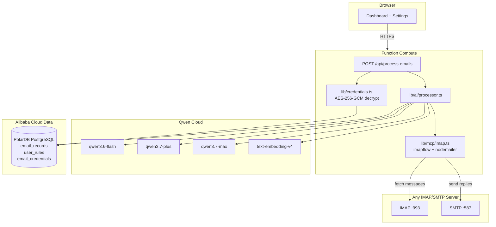

# IMAP/SMTP Refactor Plan

**Branch:** `refactor/imap-smtp`  
**Status:** Discussion / Pre-implementation

---

## Why Refactor?

The current implementation relies on **Google Cloud APIs** (Gmail REST API + Google Calendar API) accessed via OAuth 2.0 tokens. This creates three friction points:

1. **Google-only lock-in** — users must have a Gmail account; non-Gmail inboxes (Outlook, ProtonMail Bridge, self-hosted) are entirely unsupported.
2. **OAuth complexity** — requires a verified Google Cloud project, consent screen approval, and refresh-token management. The current `auth.ts` requests `https://mail.google.com/` scope, which triggers Google's security review for "restricted" scopes.
3. **Calendar dependency** — `lib/mcp/calendar.ts` is currently a stub waiting on Phase 5, so removing the Google Calendar API now costs nothing.

Switching to **IMAP + SMTP** makes the agent work with **any** standards-compliant mailbox (Gmail via App Password, Outlook, Fastmail, self-hosted Postfix, etc.) and removes the Google Cloud project requirement entirely.

---

## Library Evaluation

IMAP and SMTP are two different protocols serving different purposes — you need **both**:

| Protocol | Direction | Library | License |
|---|---|---|---|
| **IMAP** | Read / manage mailbox | [`imapflow`](https://github.com/postalsys/imapflow) | MIT |
| **SMTP** | Send / reply | [`nodemailer`](https://github.com/nodemailer/nodemailer) | MIT |

Both are maintained by **Andris Reinman** and are designed to work as a pair. Neither is a replacement for the other.

### `imapflow` — IMAP reading & mailbox management

**Why:**
- Modern `async/await` + async-iterator API; no callback hell.
- Auto-detects and handles IMAP extensions: CONDSTORE, QRESYNC (efficient incremental sync), IDLE (push notifications), COMPRESS.
- Built-in mailbox locking so concurrent requests don't corrupt state.
- SOCKS/HTTP CONNECT proxy support — useful for deployments behind a bastion.
- Powers **EmailEngine** (the larger postalsys product), so it is battle-tested at scale.

**Sample usage pattern we'd adopt:**
```ts
import { ImapFlow } from 'imapflow';

const client = new ImapFlow({
  host: credentials.imapHost,
  port: credentials.imapPort,
  secure: true,
  auth: { user: credentials.email, pass: credentials.appPassword },
  logger: false,
});

await client.connect();
const lock = await client.getMailboxLock('INBOX');
try {
  for await (const msg of client.fetch('1:50', { envelope: true, bodyParts: ['TEXT'] })) {
    // process each message
  }
} finally {
  lock.release();
}
await client.logout();
```

### `nodemailer` — SMTP sending & replies

The de-facto standard for SMTP in Node.js. Handles TLS, STARTTLS, auth, attachments, and MIME construction automatically.

### EmailEngine — evaluated, not adopted (self-hosted gateway)

[postalsys/emailengine](https://github.com/postalsys/emailengine) is a full headless email gateway (REST API over IMAP/SMTP/Gmail/MS Graph). It would give us a unified REST interface and handle things like incremental sync, webhooks, and connection pooling.

**However:**
- **Not free** — "source available"; requires a paid subscription beyond a 14-day trial.
- Requires Redis, a separate service deployment, and significant ops overhead.
- Overkill for our single-tenant agent use case.

**Verdict:** Use `imapflow` + `nodemailer` directly. If the project grows into a multi-tenant SaaS, revisiting EmailEngine as a backend would make sense.

### Mailspring — reference only (not a library)

[Foundry376/Mailspring](https://github.com/Foundry376/Mailspring) is a desktop email client (Electron + TypeScript + C++ sync engine). It is **not** a library — we cannot import it. However, it is a valuable **architectural reference** for:
- How to model mailbox rules and priorities in the data layer.
- How to handle IMAP folder sync with a local cache.
- Pattern for separating the sync engine from the UI.

---

## What Changes

### Authentication (`src/auth.ts`)

**Current:** NextAuth.js Google provider requesting `https://mail.google.com/` and `https://www.googleapis.com/auth/calendar` OAuth scopes, storing `access_token` + `refresh_token` in PolarDB.

**New:** NextAuth.js switches to **Credentials provider** (email + password UI) or stays as Google OAuth but **only** for identity (openid/email/profile — no restricted scopes). IMAP/SMTP credentials are stored separately, encrypted at rest in a new `email_credentials` table.

```diff
- scope: ["openid","email","profile","https://mail.google.com/","https://www.googleapis.com/auth/calendar"].join(" ")
+ scope: ["openid","email","profile"].join(" ")
```

The IMAP/SMTP connection details (host, port, username, app password) are collected via the Settings UI and saved encrypted to the DB.

### `src/lib/mcp/gmail.ts` → `src/lib/mcp/imap.ts`

The file is replaced in-place. The public surface stays compatible:

| Old export | New export | Change |
|---|---|---|
| `fetchRecentEmails(accessToken, maxResults)` | `fetchRecentEmails(credentials, maxResults)` | `accessToken: string` → `credentials: ImapCredentials` |
| `sendReply(accessToken, ...)` | `sendReply(credentials, ...)` | Same shape, uses `nodemailer` internally |
| `markAsRead(accessToken, id)` | `markAsRead(credentials, uid)` | Gmail `messageId` → IMAP `uid` (numeric) |
| `archiveEmail(accessToken, id)` | `archiveEmail(credentials, uid)` | Move to `[Gmail]/All Mail` or `Archive` folder |

### `src/lib/mcp/calendar.ts`

The calendar module is currently a **stub** (both functions return dummy data). We have two options:

- **Drop it** — remove the stub and delete the Google Calendar scope from auth. Calendar features deferred indefinitely.
- **Replace with CalDAV** — use [`tsdav`](https://github.com/natelindev/tsdav) (MIT) to implement CalDAV support for iCloud, Google, and Nextcloud calendars without the Google Cloud project requirement.

**Recommended for this refactor:** Drop the stub now, open a follow-up issue for CalDAV in Phase 6.

### `src/lib/actions/email-actions.ts`

No interface changes — only the `gmail.ts` imports swap to `imap.ts`.

### `src/app/api/process-emails/route.ts`

Replace `accessToken` lookup with `credentials` lookup from the new `email_credentials` table.

### `scripts/db/schema.sql`

Add a new table for storing IMAP/SMTP credentials, encrypted:

```sql
CREATE TABLE email_credentials (
  id          UUID PRIMARY KEY DEFAULT gen_random_uuid(),
  user_id     TEXT NOT NULL REFERENCES users(id) ON DELETE CASCADE,
  imap_host   TEXT NOT NULL,
  imap_port   INT  NOT NULL DEFAULT 993,
  smtp_host   TEXT NOT NULL,
  smtp_port   INT  NOT NULL DEFAULT 587,
  username    TEXT NOT NULL,
  -- app password / token, encrypted with AES-256-GCM at application layer
  secret_enc  TEXT NOT NULL,
  created_at  TIMESTAMPTZ NOT NULL DEFAULT now(),
  updated_at  TIMESTAMPTZ NOT NULL DEFAULT now(),
  UNIQUE (user_id)
);
```

> **Security note:** `secret_enc` is never stored in plaintext. The application layer encrypts with AES-256-GCM using a key from `process.env.CREDENTIAL_ENCRYPTION_KEY`. The IV + auth tag are stored alongside the ciphertext (e.g., `<iv_hex>:<tag_hex>:<ciphertext_hex>`).

### `src/components/settings/RulesEditor.tsx` + new `CredentialsForm.tsx`

Add a Settings section for IMAP/SMTP credentials (host, port, username, app password). The settings page validates the connection before saving.

---

## Data Flow After Refactor



---

## Implementation Phases

### Phase R1 — Foundation (no regressions)
- [ ] `npm install imapflow nodemailer @types/nodemailer`
- [ ] Add `email_credentials` table to `scripts/db/schema.sql`
- [ ] Add `lib/credentials.ts` — AES-256-GCM encrypt/decrypt helpers
- [ ] Stub out `lib/mcp/imap.ts` with the same public surface as `gmail.ts`

### Phase R2 — IMAP reader
- [ ] Implement `fetchRecentEmails` in `lib/mcp/imap.ts` using `imapflow`
  - Connect, lock INBOX, fetch last N messages (envelope + text body + attachments)
  - Decode MIME parts (replaces current Gmail base64url decode)
  - Map to the existing `Email` type from `types/email.ts`
- [ ] Remove `lib/mcp/gmail.ts` and update all imports

### Phase R3 — SMTP sender
- [ ] Implement `sendReply` in `lib/mcp/imap.ts` using `nodemailer`
- [ ] Implement `markAsRead` and `archiveEmail` via IMAP flag/move operations

### Phase R4 — Auth + Settings UI
- [ ] Strip Gmail/Calendar scopes from `src/auth.ts`
- [ ] Add `CredentialsForm.tsx` to Settings page
- [ ] Add `src/lib/actions/credential-actions.ts` (save/load/validate credentials)
- [ ] Add `POST /api/credentials/validate` route (test IMAP connect before saving)

### Phase R5 — Calendar (future)
- [ ] Evaluate `tsdav` for CalDAV support
- [ ] Open tracking issue; out of scope for this refactor

---

## Open Questions / Discussion Points

1. **App Password vs OAuth IMAP** — Gmail supports both `XOAUTH2` (OAuth) and App Passwords over IMAP. App Passwords are simpler to implement but require the user to have 2FA enabled. Should we support `XOAUTH2` for Gmail as an optional auth method? (`imapflow` supports it via the `auth.accessToken` option.)

2. **Connection pooling** — Each `process-emails` invocation currently creates a fresh IMAP connection. For a high-frequency agent, a persistent connection with IMAP IDLE would be more efficient. Worth implementing in Phase R2 or defer?

3. **MIME decoding library** — `imapflow` returns raw MIME parts. We currently decode Gmail's base64url bodies ourselves (69 lines in `gmail.ts`). We could either keep that logic or bring in [`mailparser`](https://github.com/nodemailer/mailparser) (MIT, by Andris Reinman) to handle complex multipart/mixed/alternative structures cleanly.

4. **Attachment storage** — The current Gmail code tracks `attachmentId` (a Gmail-specific opaque ID). With IMAP, attachments are accessed via BODY section references. The `EmailAttachment` type in `types/email.ts` will need a `sectionPath` field instead of `attachmentId`.

5. **UID vs sequence numbers** — IMAP exposes both `uid` (persistent) and sequence numbers (ephemeral). We should always use UIDs in our implementation to avoid race conditions when new mail arrives mid-fetch. `imapflow` uses UIDs by default when you pass `{ uid: true }` to fetch calls.

6. **Multi-mailbox / folder support** — Currently only INBOX is fetched. Should the refactor include a folder-selection option in the Settings UI?

---

## Files Touched Summary

| File | Action |
|---|---|
| `src/auth.ts` | Remove Gmail/Calendar OAuth scopes |
| `src/lib/mcp/gmail.ts` | **Delete** (replaced) |
| `src/lib/mcp/imap.ts` | **Create new** |
| `src/lib/mcp/calendar.ts` | **Delete** stub (or keep as CalDAV placeholder) |
| `src/lib/credentials.ts` | **Create new** (AES-256-GCM helpers) |
| `src/lib/actions/email-actions.ts` | Update imports |
| `src/lib/actions/credential-actions.ts` | **Create new** |
| `src/app/api/process-emails/route.ts` | Swap token → credentials lookup |
| `src/app/api/credentials/validate/route.ts` | **Create new** |
| `src/components/settings/RulesEditor.tsx` | No change |
| `src/components/settings/CredentialsForm.tsx` | **Create new** |
| `scripts/db/schema.sql` | Add `email_credentials` table |
| `package.json` | Add `imapflow`, `nodemailer`, `@types/nodemailer` |
| `PLAN.md` | Update tech stack table and architecture diagram |
